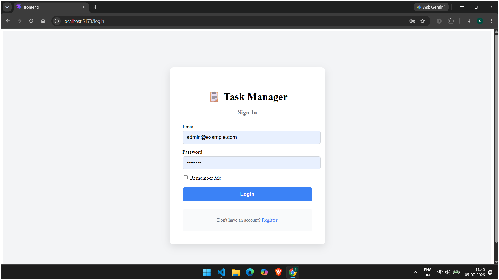
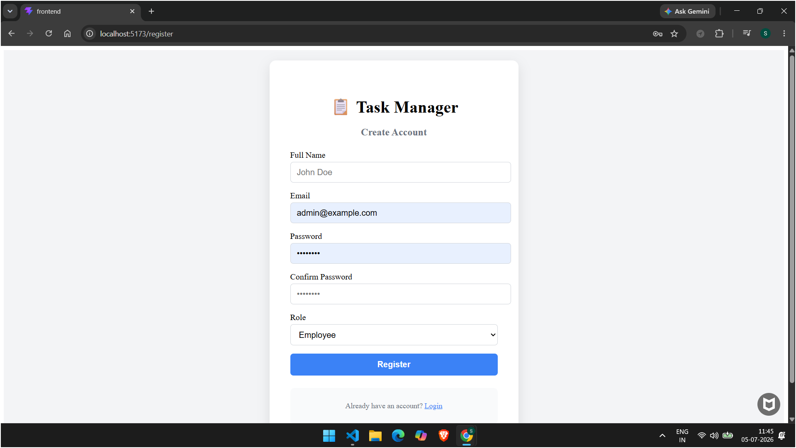
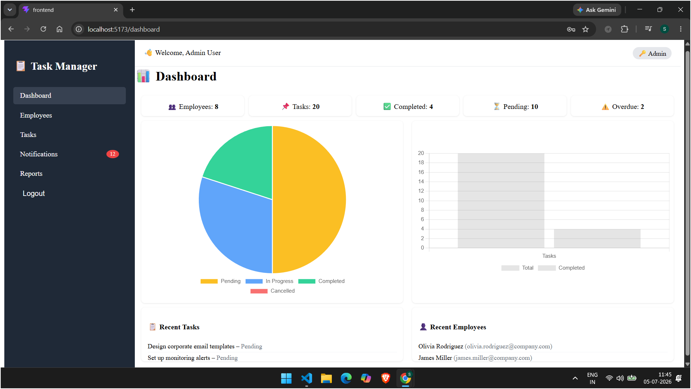
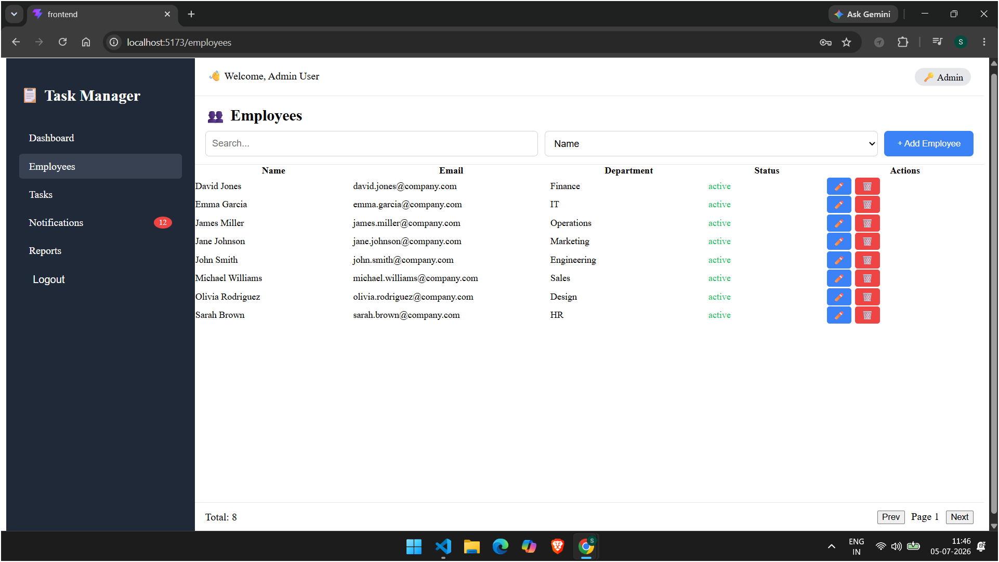
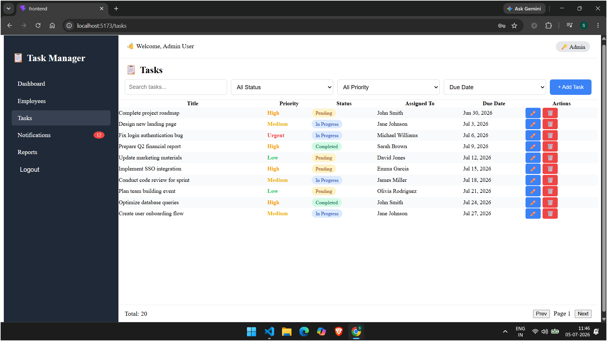
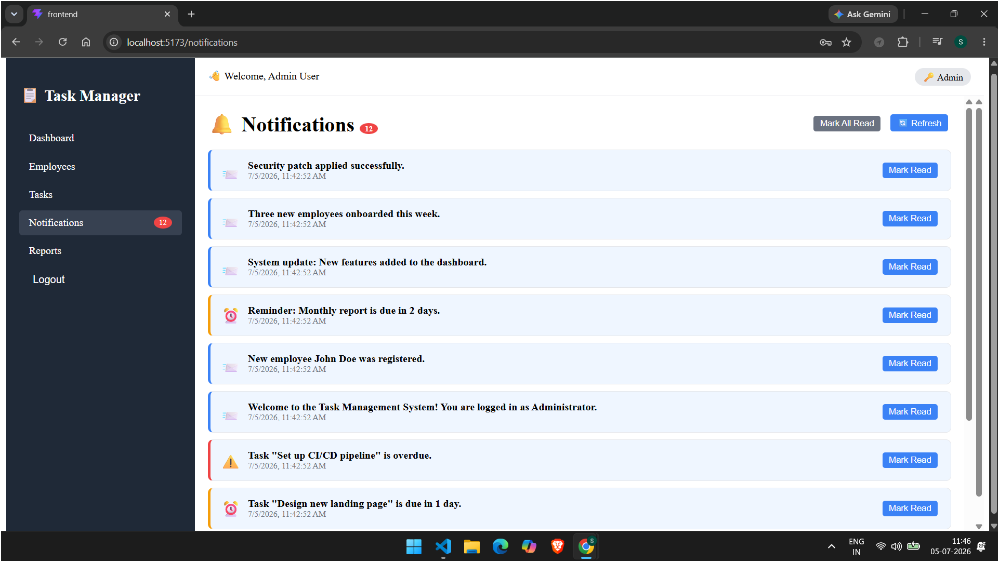
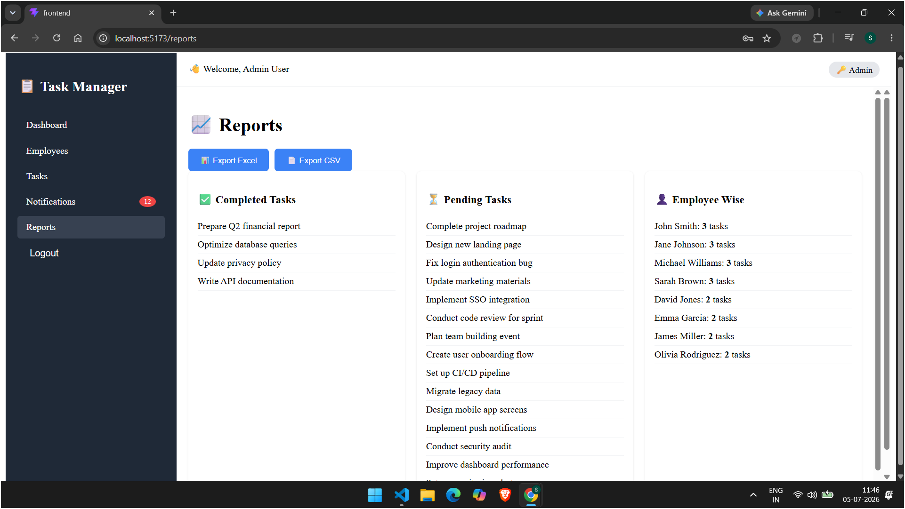

# 📋 Task Manager – Full Stack Application

## 📖 Introduction

The **Task Manager System** is a Full Stack MERN application designed to simplify employee task management within an organization. It provides a secure platform where administrators can manage employees, assign tasks, monitor progress, generate reports, and notify users about important updates.

The system follows a client-server architecture where the React frontend communicates with the Express backend through REST APIs. The backend handles authentication, business logic, database operations, file uploads, and email notifications, while MongoDB stores all application data.


# 📸 Application Screenshots

## 🔐 Login Page

<p align="center">
  
</p>

---

## 📝 Register Page

<p align="center">
  
</p>

---

## 📊 Dashboard

<p align="center">
  
</p>

---

## 👨‍💼 Employee Management

<p align="center">
  
</p>

---

## ➕ Add Employee

<p align="center">
  
</p>

---

## ✅ Task Management

<p align="center">
  
</p>

---

## 🔔 Notifications

<p align="center">
  
</p>

---

## 📈 Reports

<p align="center">
  
</p>


---

## ✨ Features

- **Authentication** – Register, login, JWT‑based sessions with "Remember Me".
- **Role‑based access** – Admin and Employee roles with different permissions.
- **Employee Management** – Create, read, update, delete employees (Admin only).
- **Task Management** – Full CRUD for tasks; priority (Low/Medium/High/Urgent), status (Pending/In Progress/Completed/Cancelled), assignment to employees, and file attachments.
- **Dashboard** – Overview of task statistics, status distribution charts (Pie/Bar), recent tasks, and recent employees.
- **Notifications** – In‑app notifications for task assignments, updates, due‑date reminders, and overdue alerts. Mark as read / mark all read.
- **Reports** – View completed tasks, pending tasks, employee‑wise task counts, and export to Excel or CSV.
- **File Uploads** – Attach PDF, PNG, JPG images to tasks.
- **Email Notifications** – Automatic email alerts for task events (uses Gmail SMTP – optional).
- **Auto‑seeding** – Sample data (1 admin, 8 employees, 20 tasks, notifications) inserted on first server start (or manually via `npm run seed`).

---

## 📸 Screenshots

The `screenshots/` folder contains the following images (place your screenshots there):

| Filename | Description |
|----------|-------------|
| `register.png` | Registration page with form fields (Full Name, Email, Password, Confirm Password, Role). |
| `Login.png` | Login page with email, password, and "Remember Me" checkbox. |
| `dashboard.png` | Admin dashboard showing stats, pie/bar charts, recent tasks, and employees. |
| `Task.png` | Task list with search, filters, pagination, and action buttons (edit/delete). |
| `employes.png` | Employee list with search, sorting, and "Add Employee" button. |
| `New emploes added.png` | Add/Edit employee modal with form fields and save/cancel. |
| `Report.png` | Reports page showing completed tasks, pending tasks, and employee‑wise task counts. |

---

## 🛠️ Tech Stack

### Backend
- **Node.js** + **Express.js**
- **MongoDB** + **Mongoose** (ODM)
- **JWT** for authentication
- **Bcrypt.js** for password hashing
- **Multer** for file uploads
- **Nodemailer** for email notifications
- **Express‑validator** for input validation
- **ExcelJS** & **csv‑writer** for report exports

### Frontend
- **React** with **TypeScript**
- **Redux Toolkit** for state management
- **React Router DOM** for routing
- **React Hook Form** + **Yup** for form validation
- **Chart.js** (via `react-chartjs-2`) for charts
- **React Toastify** for toast notifications

---

## 📦 Installation & Setup

### Prerequisites
- Node.js (v14 or higher)
- MongoDB (local or MongoDB Atlas cloud)
- Git (optional)

### 1. Clone the repository
```bash
git clone https://github.com/yourusername/task-manager.git
cd task-manager
```

### 2. Backend Setup
```bash
cd backend
npm install
```

Create a `.env` file in the `backend` folder (optional – defaults are provided):
```env
PORT=5000
MONGO_URI=mongodb://localhost:27017/employee-task-management
JWT_SECRET=your_secret_key_here
EMAIL_USER=your_email@gmail.com
EMAIL_PASS=your_app_password
```

### 3. Frontend Setup
```bash
cd ../frontend
npm install
```

---

## 🚀 Running the Application

### Start the Backend
```bash
cd backend
npm run dev       # or npm start
```
The server runs at `http://localhost:5000`.  
If the database is empty, sample data is auto‑inserted.

### Start the Frontend
```bash
cd frontend
npm start
```
The React app runs at `http://localhost:3000`.

### Seeding Data Manually (reset & re‑seed)
```bash
cd backend
npm run seed
```

---

## 📁 Folder Structure (Backend)

```
backend/
├── index.js                 # Entry point
├── app.js                   # Express app setup
├── config/
│   └── index.js             # Configuration
├── models/
│   ├── User.js
│   ├── Task.js
│   └── Notification.js
├── middleware/
│   ├── auth.js
│   ├── validation.js
│   └── upload.js
├── controllers/
│   ├── authController.js
│   ├── employeeController.js
│   ├── taskController.js
│   ├── notificationController.js
│   ├── reportController.js
│   └── dashboardController.js
├── routes/                  # All route files
├── utils/
│   ├── email.js
│   ├── notifications.js
│   └── seedData.js
└── scripts/
    └── seed.js
```

---

## 🔐 Default Users (Sample Data)

After seeding, these credentials are available:

| Role     | Email                   | Password   |
|----------|-------------------------|------------|
| Admin    | `admin@example.com`     | `admin123` |
| Employee | *(any employee email)*  | `employee123` |

**Employee emails:**  
`john.smith@company.com`, `jane.johnson@company.com`, `michael.williams@company.com`, `sarah.brown@company.com`, `david.jones@company.com`, `emma.garcia@company.com`, `james.miller@company.com`, `olivia.rodriguez@company.com`.

---

## 📡 API Endpoints (Key Endpoints)

| Method | Endpoint                   | Description                     |
|--------|----------------------------|---------------------------------|
| POST   | `/api/auth/register`       | Register a new user            |
| POST   | `/api/auth/login`          | Login user                     |
| GET    | `/api/auth/me`             | Get current user profile       |
| GET    | `/api/employees`           | List employees (admin only)    |
| POST   | `/api/employees`           | Create employee (admin only)   |
| GET    | `/api/tasks`               | List tasks (with filters)      |
| POST   | `/api/tasks`               | Create a task (admin)          |
| PUT    | `/api/tasks/:id`           | Update a task                  |
| DELETE | `/api/tasks/:id`           | Delete a task                  |
| GET    | `/api/notifications`       | Get user notifications         |
| GET    | `/api/dashboard`           | Dashboard statistics           |
| GET    | `/api/reports/*`           | Reports & exports              |

Full API documentation can be added later (e.g., using Swagger).

---

## 🧪 Testing

Test the API with **Postman** or **Insomnia** using the endpoints above.  
Use the default credentials for authorization (JWT token).

---

## 🤝 Contributing

1. Fork the repository.
2. Create a feature branch: `git checkout -b feature/your-feature`.
3. Commit your changes: `git commit -m 'Add some feature'`.
4. Push to the branch: `git push origin feature/your-feature`.
5. Open a pull request.

---

# 🤝 Contributing

1. Fork Repository

2. Create Feature Branch

```bash
git checkout -b feature-name
```

3. Commit

```bash
git commit -m "Added New Feature"
```

4. Push

```bash
git push origin feature-name
```

5. Create Pull Request

---

# 📄 License

This project is licensed under the **MIT License**.

---

# 👨‍💻 Author

### Swapnil Kadam

💼 MERN Stack Developer

📧 your-email@example.com

🌐 Portfolio

```
https://swapnilk1806-portfolio.vercel.app/
```

💻 GitHub

```
https://github.com/swapnilk1806
```

🔗 LinkedIn

```
https://www.linkedin.com/in/swapnil-kadam-9b074122b/
```

---


## 📄 License

This project is licensed under the MIT License – see the [LICENSE](LICENSE) file for details.

---

## ✉️ Contact

For any questions or support, please open an issue on GitHub or contact [your-email@example.com](mailto:your-email@example.com).

> **Happy Tasking!** 🚀